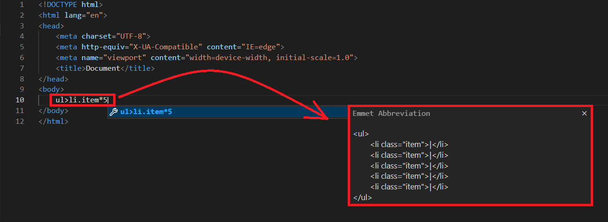

## DAY 1 : INTRODUCTION

### 1. What is Emmet ?
**Emmet** is a powerful and widely used web development tool that helps you write HTML and CSS code more efficiently. It provides shortcuts and abbreviations, known as **Emmet abbreviations** or snippets, to quickly generate HTML and CSS code with less typing.

Here are some key features and benefits of Emmet:

1. **Abbreviations:** Emmet allows you to write short abbreviations and expand them into complete HTML or CSS code snippets. For example, you can type **ul>li.item*5** and expand it to a list with five list items.
   
   
##

### 2. 